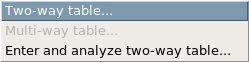
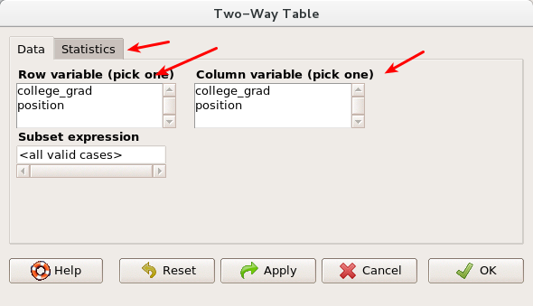
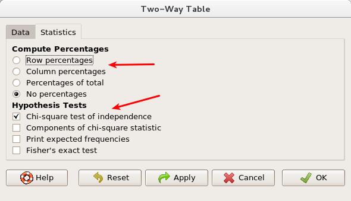
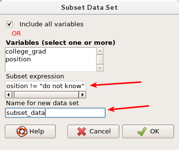
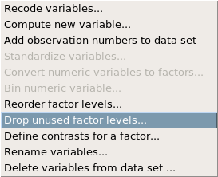

## The Data: Offshore drilling

A 2010 survey asked 827 randomly sampled registered voters in California “Do you support? Or do you oppose? Drilling for oil and natural gas off the Coast of California? Or do you not know enough to say?” The data was separated based on whether or not the respondent graduated from college.<sup>[[1]](#ftnt1)</sup>

The responses have been collected and put into a dataset, which can be downloaded from the following link:

[https://drive.google.com/open?id=1bCQ6CI7PgAvsZ5R3hdgUq8UbOrvIJO6SDvInRZBNCOE](https://drive.google.com/open?id%3D1bCQ6CI7PgAvsZ5R3hdgUq8UbOrvIJO6SDvInRZBNCOE)

Download this data set as a csv file (see “download as”), then load the data into R Commander. Pay attention to how the dataset is being interpreted, you may need to modify the default importing setting and/or the types of variables. Make your new dataset the active data set. Inspect and summarize the data, and address the following questions:

1.  How many cases and how many variables are in the data set? What types of variables are present in the data set?

We’re interested in determining whether there’s a relationship between the two variables in the data set.

2.  What are the null and alternative hypotheses for this experiment? Write down a confidence level to use for the experiment.

We will inspect the data and conduct a Chi-square test by creating a two-way table. Under statistics, then contingency tables, select Two-way table.





You can select either variable for row or for column (but remember which you have selected). Once you have chosen, select the Statistics tab **before**  clicking ok.



Notice the options in the Two-Way Table menu. R Commander can tell you row percentages, column percentages, percentages or total, or no percentages. Keep no percentages for the moment. The default is also to run a Chi-square test, and you can optionally see further components of the Chi-square calculation, as well as an expected frequencies table. Select the expected frequencies box, and components of the chi-square statistic if you would like, and click ok. You will see output in the R Commander window.

Look at the table of expected values in the output.

3.  Are the conditions for running a chi-square test satisfied?

Now look at the results of the test.

4.  What conclusion do you make about the results?

Now that you have a conclusion, look back to your counts. How do you interpret your conclusion? Do you think that **all**  of the groups are different from each other? To investigate this, we will look at the conditional probability tables.

5.  In the two way table menu, in the statistics tab, select row percentages, then print the results. Do the same for column percentages. What do each of these tables tell you? Pick one or two values from each of the two tables and state carefully what that number tells you.

## Subgroup analysis

It seems that the `do not know` group is different from the other groups, but it is not clear whether we can say that the `oppose` group is different from the `support` group. We will perform a subgroup analysis to investigate what happens when we remove the `do not know` group from the analysis.

We need to create a new data set, so select the data menu, then active data set, then subset active data set. In the subset expression box, enter

```{r eval=FALSE}
position != “do not know”
```

(!= is R’s way of saying “not equal”). Give your new data set a different name, and click ok.



Inspect your new data set by displaying a summary of the new active data set. Something should strike you as problematic - it still displays “do not know” as a possible answer choice. Why would it be incorrect to run a chi square tests on this new data set right now?

We need to remove that option from the data set, so in the data menu, select manage variables in active data set, then drop unused factor levels.



After you have done this, have R Commander display the data set summary, which should no longer have a `do not know` option.

Perform a chi-square test on this new data set. What do you conclude?

* * *


## On Your Own

- You will analyze another data set: jimi.ithaca.edu/~mthomas7/military.csv. This will be a large file - be patient if you click view data set, it will take some time to view. The data was downloaded from the department of defense, [https://explore.data.gov/Population/Personnel-Trends-by-Gender-Race/zqae-ad8k}{data.gov](https://explore.data.gov/Population/Personnel-Trends-by-Gender-Race/zqae-ad8k) on Feb 20, 2012. While this data comes from the entire military, we will consider the data to be a sample of the possible army make-ups that would be possible.  This dataset contains demographic information on every member of the US armed forces including gender, race, and rank. It is a data frame with 1414593 observations on the following 6 variables:

a grade: The status of the service member as `enlisted, officer, `or` warrant officer`.

b branch: The branch of the armed forces: `air force, army, marine corps, navy`.

c gender: Whether the service member is `female` or `male`.

d race: The race identified by the service member: `ami/aln` (american indian/alaskan native), `asian`, `black`, `multi` (multi-ethinic), `p/i` (pacific islander), `unk` (unknown), or `white`.

e hisp: Whether a service member identifies with being hispanic `TRUE` or not `FALSE`.

f rank: The numeric rank of the service member (higher number indicates higher rank)

The branches covered by this data set include the Army, Navy, Air Force, and Marine Corps.  Demographic information on the Coast Guard is contained in the original data set but has not been included here.

Import the data set. The fields in the file are separated by tabs.

Select two variables in this data set (do not select gender and hisp as your two variables, so that you can answer question number 4) which you can analyze using a chi-square test. Write down your null and alternative hypotheses, and select a significance level.

- Perform your chi square test. What do you conclude from your test? Write down the actual results of the test (e.g. the chi-square value and the p-value) and your interpretation of the result in real world terms.
- View conditional probability tables to get a better feel for what your results tell you.
- Perform a subgroup analysis by selecting a subset of your data. Select your subgroups based on your inspection in the previous problem.


<div id="license">
This is a product of OpenIntro that is released under a [Creative Commons 
Attribution-ShareAlike 3.0 Unported](http://creativecommons.org/licenses/by-sa/3.0). 
This lab was written by Matt Thomas for OpenIntro.
</div>


[[1]](#ftnt_ref1) Survey USA, Election Poll #16804, data collected July 8-11, 2010.