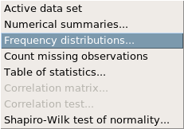
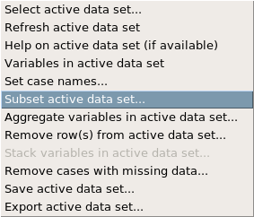
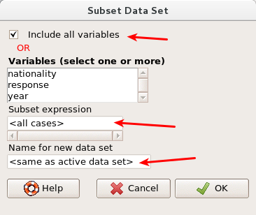
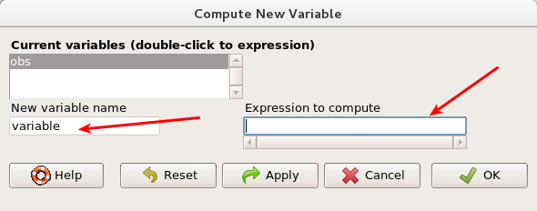

In August of 2012, news outlets ranging from the [Washington Post](http://www.washingtonpost.com/national/on-faith/poll-shows-atheism-on-the-rise-in-the-us/2012/08/13/90020fd6-e57d-11e1-9739-eef99c5fb285_story.html) to the [Huffington Post](http://www.huffingtonpost.com/2012/08/14/atheism-rise-religiosity-decline-in-america_n_1777031.html) ran a story about the rise of atheism in America. The source for the story was a poll that asked people, “Irrespective of whether you attend a place of worship or not, would you say you are a religious person, not a religious person or a convinced atheist?” This type of question, which asks people to classify themselves in one way or another, is common in polling and generates categorical data. In this lab we take a look at the atheism survey and explore what’s at play when making inference about population proportions using categorical data.

## The survey

To access the press release for the poll, conducted by WIN-Gallup International, click on the following link:

[http://www.wingia.com/web/files/richeditor/filemanager/Global_INDEX_of_Religiosity_and_Atheism_PR__6.pdf](http://www.wingia.com/web/files/richeditor/filemanager/Global_INDEX_of_Religiosity_and_Atheism_PR__6.pdf)

Take a moment to review the report then address the following questions.

1.  In the first paragraph, several key findings are reported. Do these percentages appear to be *sample statistics* (derived from the data sample) or *population parameters* ?

2.  The title of the report is "Global Index of Religiosity and Atheism". To generalize the report's findings to the global human population, what must we assume about the sampling method? Does that seem like a reasonable assumption?

## The data

Turn your attention to Table 6 (pages 15 and 16), which reports the sample size and response percentages for all 57 countries. While this is a useful format to summarize the data, we will base our analysis on the original data set of individual responses to the survey. Load this data set into R with the following command:

```{r eval=FALSE}
download.file`(`"http://www.openintro.org/stat/data/atheism.RData"`, `destfile =``"atheism.RData"`)`
```

Then load the data set and make it active.

3. What does each row of Table 6 correspond to? What does each row of `atheism` correspond to?

To investigate the link between these two ways of organizing this data, take a look at the estimated proportion of atheists in the United States. Towards the bottom of Table 6, we see that this is 5%. We should be able to come to the same number using the `atheism` data.

We need to create a subset of the data containing only the US residents in the year 2012. Take a look at the dataset to determine how the nationality of US residents if coded. You will find that the summary of the active data set will not answer this question because there are too many nationalities to list. Instead, let’s look at the frequency distribution of nationalities, under statistics:



What do you see that describes US residents?

We can now create our subset. Go to data, then active dataset, then subset active data set:





4.  We will include all variables, so leave the checkbox for including all variables checked. For the subset expression, we want to only include US residents and only in the year 2012. In this box, then, we will enter the command `nationality == "United States" & year == "2012"`. Name your dataset `us12`. Inspect it using the summary of active dataset. Does this data agree with the percentage in Table 6? If not, why?

## Inference on proportions

As was hinted at in Exercise 1, Table 6 provides *statistics* , that is, calculations made from the sample of 51,927 people. What we’d like, though, is insight into the population *parameters* . You answer the question, "What proportion of people in your sample reported being atheists?" with a statistic; while the question "What proportion of people on earth would report being atheists" is answered with an estimate of the parameter.

The inferential tools for estimating population proportion are analogous to those used for means in the last chapter: the confidence interval and the hypothesis test.

5.  Write out the conditions for inference to construct a 95% confidence interval for the proportion of atheists in the United States in 2012. Are you confident all conditions are met?

If the conditions for inference are reasonable, we can either calculate the standard error and construct the interval by hand, or allow R Commander to do it for us.

In the Statistics menu, select proportions, then single-sample proportion test.


(Notice Two-sample proportion tests are not an option for the active data set.)

Note that since the goal is to construct an interval estimate for a proportion, it’s necessary to specify what constitutes a "success"", which here is a response of `atheist` based on the way the data was originally entered.

Conduct a one-sample proportion test, checking the options tab to make sure the choices are what you want for the output to report a 95% confidence interval. You should see a confidence interval in your output.

Although formal confidence intervals and hypothesis tests don’t show up in the report, suggestions of inference appear at the bottom of page 7: "In general, the error margin for surveys of this kind is $\pm$ 3-5% at 95% confidence".

6.  Based on the R output, what is the margin of error for the estimate of the proportion of the proportion of atheists in US in 2012?

7.  Calculate confidence intervals for the proportion of atheists in 2012 in two other countries of your choice, and report the associated margins of error. Be sure to note whether the conditions for inference are met. It may be helpful to create new data sets for each of the two countries first, and then use these data sets in the inference function to construct the confidence intervals.

## How does the proportion affect the margin of error?

Imagine you’ve set out to survey 1000 people on two questions: are you female? and are you left-handed? Since both of these sample proportions were calculated from the same sample size, they should have the same margin of error, right? Wrong! While the margin of error does change with sample size, it is also affected by the proportion.

Think back to the formula for the standard error: . This is then used in the formula for the margin of error for a 95% confidence interval: . Since the population proportion  is in this ME formula, it should make sense that the margin of error is in some way dependent on the population proportion. We can visualize this relationship by creating a plot of vs. .

Run the following code line-by-line to create this plot. (See if you can figure out what each line is doing.)

```{r eval=FALSE}
n <- 1000
p <- seq(0, 1, 0.01)
me <- 2 * sqrt(p * (1 - p)/n)
plot(me ~ p, ylab = "Margin of Error", xlab = "Population Proportion")
```

8. Describe the relationship between `p` and `me`.

## Success-failure condition

The textbook emphasizes that you must always check conditions before making inference. For inference on proportions, the sample proportion can be assumed to be nearly normal if it is based upon a random sample of independent observations and if both  and . This rule of thumb is easy enough to follow, but it makes one wonder: what’s so special about the number 10?

The short answer is: nothing. You could argue that we would be fine with 9 or that we really should be using 11. What is the “best” value for such a rule of thumb is, at least to some degree, arbitrary. However, when np and n(1−p) reaches 10 the sampling distribution is sufficiently normal to use confidence intervals and hypothesis tests that are based on that approximation.

We can investigate the interplay between n and p and the shape of the sampling distribution by using simulations. To start off, we will want to simulate the process of drawing 5000 samples of size 1040 from a population with a true atheist proportion of 0.1. This will be done in 2 steps:

1.  Determine the number of atheists in each sample. We can model this as coming from a binomial distribution. Sample from a binomial distribution where the probability of success is 0.1, the number of trials is 1040 (this is the number of people being surveyed), and 5000 samples are taken. Name this variable `atheistsimulation`. Inspect your new data. This should be the number of people reporting as atheists from each sample.
3.  Determine the proportion of atheists in each sample. To do this, we will need to create a new variable, which should simply be the value of `atheistsimulation` divided by the total number of people surveyed, 1040. Go to data, then manage variables in active data set, then compute new variable.



For the new variable name, we will use `phat`. For the expression to compute, it is just each observation divided by 1040, so enter `obs/1040`. Then click ok to create the new variable. This has computed  for each of the 5000 samples. Plot a histogram of the  values. This process builds up the sampling distribution of .

9.  Describe the sampling distribution of sample proportions at n=1040 and p=0.1. Be sure to note the center, spread, and shape. *Hint:*  Remember that R has functions such as `mean` to calculate summary statistics.

10. Repeat the above simulation three more times but with modified sample sizes and proportions: for n=400 and p=0.1, n=1040 and p=0.02, and n=400 and p=0.02. Plot each histograms and same them so that you can compare. Describe the three new sampling distributions. Based on these limited plots, how does n appear to affect the distribution of ? How does  affect the sampling distribution?

11. If you refer to Table 6, you’ll find that Australia has a sample proportion of 0.1 on a sample size of 1040, and that Ecuador has a sample proportion of 0.02 on 400 subjects. Let’s suppose for this exercise that these point estimates are actually the truth. Then given the shape of their respective sampling distributions, do you think it is sensible to proceed with inference and report margin of errors, as the reports does?

* * *


## <span class="c17">On your own</span>

The question of atheism was asked by WIN-Gallup International in a similar survey that was conducted in 2005. (We assume here that sample sizes have remained the same.) Table 4 on page 13 of the report summarizes survey results from 2005 and 2012 for 39 countries.

- Answer the following two questions. As always, write out the hypotheses for any tests you conduct and outline the status of the conditions for inference.

- Is there convincing evidence that Spain has seen a change in its atheism index between 2005 and 2012? *Hint:*  Create a new data set for respondents from Spain. Form confidence intervals for the true proportion of atheists in both years, and determine whether they overlap.
3.  Is there convincing evidence that the United States has seen a change in its atheism index between 2005 and 2012?

- If in fact there has been no change in the atheism index in the countries listed in Table 4, in how many of those countries would you expect to detect a change (at a significance level of 0.05) simply by chance? *Hint:*  Look in the textbook index under Type 1 error.

- Suppose you’re hired by the local government to estimate the proportion of residents that attend a religious service on a weekly basis. According to the guidelines, the estimate must have a margin of error no greater than 1% with 95% confidence. You have no idea what to expect for p. How many people would you have to sample to ensure that you are within the guidelines? *Hint:*  Refer to your plot of the relationship between p and margin of error. Do not use the data set to answer this question.


<div id="license">
This is a product of OpenIntro that is released under a [Creative Commons 
Attribution-ShareAlike 3.0 Unported](http://creativecommons.org/licenses/by-sa/3.0). 
This lab was adapted by Matt Thomas for OpenIntro from a lab by Andrew Bray and Mine &Ccedil;etinkaya-Rundel.
</div>