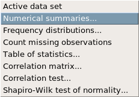
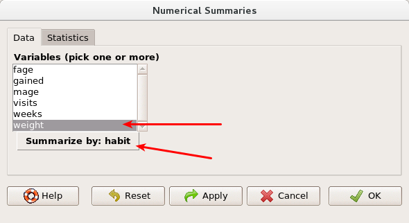
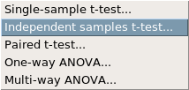
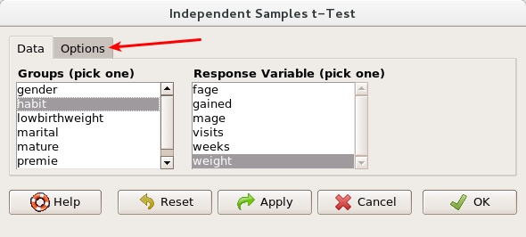

## North Carolina births

In 2004, the state of North Carolina released a large data set containing information on births recorded in this state. This data set is useful to researchers studying the relation between habits and practices of expectant mothers and the birth of their children. We will work with a random sample of observations from this data set.

## Exploratory analysis

Load the nc data set into our workspace.

```{r eval=FALSE}
download.file("http://www.openintro.org/stat/data/nc.RData", destfile ="nc.RData")
```

Load the data set, and make sure to make the nc data set active.

We have observations on 13 different variables, some categorical and some numerical. The meaning of each variable is as follows.

<table cellpadding="0" cellspacing="0" class="c6"><tbody><tr class="c15"><td class="c35" colspan="1" rowspan="1">

variable

</td><td class="c31" colspan="1" rowspan="1">

description

</td></tr><tr class="c15"><td class="c16" colspan="1" rowspan="1">

fage

</td><td class="c9" colspan="1" rowspan="1">

father’s age in years.

</td></tr><tr class="c15"><td class="c17" colspan="1" rowspan="1">

mage

</td><td class="c12" colspan="1" rowspan="1">

mother’s age in years.

</td></tr><tr class="c15"><td class="c17" colspan="1" rowspan="1">

mature

</td><td class="c12" colspan="1" rowspan="1">

maturity status of mother.

</td></tr><tr class="c15"><td class="c17" colspan="1" rowspan="1">

weeks

</td><td class="c12" colspan="1" rowspan="1">

length of pregnancy in weeks.

</td></tr><tr class="c15"><td class="c17" colspan="1" rowspan="1">

premie

</td><td class="c12" colspan="1" rowspan="1">

whether the birth was classified as premature (premie) or full-term.

</td></tr><tr class="c15"><td class="c17" colspan="1" rowspan="1">

visits

</td><td class="c12" colspan="1" rowspan="1">

number of hospital visits during pregnancy.

</td></tr><tr class="c15"><td class="c17" colspan="1" rowspan="1">

marital

</td><td class="c12" colspan="1" rowspan="1">

whether mother is married or not married at birth.

</td></tr><tr class="c15"><td class="c17" colspan="1" rowspan="1">

gained

</td><td class="c12" colspan="1" rowspan="1">

weight gained by mother during pregnancy in pounds.

</td></tr><tr class="c15"><td class="c17" colspan="1" rowspan="1">

weight

</td><td class="c12" colspan="1" rowspan="1">

weight of the baby at birth in pounds.

</td></tr><tr class="c15"><td class="c17" colspan="1" rowspan="1">

lowbirthweight

</td><td class="c12" colspan="1" rowspan="1">

whether baby was classified as low birthweight (low) or not (not low).

</td></tr><tr class="c15"><td class="c17" colspan="1" rowspan="1">

gender

</td><td class="c12" colspan="1" rowspan="1">

gender of the baby, female or male.

</td></tr><tr class="c15"><td class="c17" colspan="1" rowspan="1">

habit

</td><td class="c12" colspan="1" rowspan="1">

status of the mother as a nonsmoker or a smoker.

</td></tr><tr class="c15"><td class="c23" colspan="1" rowspan="1">

whitemom

</td><td class="c21" colspan="1" rowspan="1">

whether mom is white or not white.

</td></tr></tbody></table>

1. What are the cases in this data set? How many cases are there in our sample?

As a first step in the analysis, we should consider summaries of the data. Have R Commander display a summary of these data.

As you review the variable summaries, consider which variables are categorical and which are numerical. Do any of the variables need to be changed? For numerical variables, are there outliers? If you aren’t sure or want to take a closer look at the data, make a graph.

Consider the possible relationship between a mother’s smoking habit and the weight of her baby. Plotting the data is a useful first step because it helps us quickly visualize trends, identify strong associations, and develop research questions.

2. Make a side-by-side boxplot of weight using habit for each value of habit. What does the plot highlight about the relationship between these two variables?

The box plots show how the medians of the two distributions compare, but we can also compare the means of the distributions using the numerical summary in the summaries menu. 



Select the box below the variable choice to summarize by groups.



There is an observed difference, but is this difference statistically significant? In order to answer this question we will conduct a hypothesis test .

## Inference

* Check if the conditions necessary for inference are satisfied. Note that you will need to obtain sample sizes to check the conditions. 
* Write the hypotheses for testing if the average weights of babies born to smoking and non-smoking mothers are different.

Next, we will conduct the test. In the statistics menu, select the means option, then select independent samples t-test.



We want to determine whether there is a difference in weights of children by smokers and non-smokers, so the grouping variable is habit and the response variable is weight. Before you click ok, select the options tab.



Here we can select whether we want to perform a one-tailed or two-tailed test, and our significance level. Perform a two-tailed test using , or equivalently a confidence of . Do not assume equal variances.

3. Go through the output line-by-line after clicking ok. What does each line tell you? What is your conclusion based on the p-value? What is your conclusion based on the confidence interval?

* * *


## On your own

- Calculate a 95% confidence interval for the average length of pregnancies (weeks) and interpret it in context. Note that since you’re doing inference on a single population parameter, this is equivalent to a single-sample t-test (and will be produced when running a single-sample t-test).
- Calculate a new confidence interval for the same parameter at the 90% confidence level.
- Conduct a hypothesis test evaluating whether the average weight gained by younger mothers is different than the average weight gained by mature mothers.
- Now, a non-inference task: Determine the age cutoff for younger and mature mothers. Use a method of your choice, and explain how your method works.
- Pick a pair of numerical and categorical variables and come up with a research question evaluating the relationship between these variables. Formulate the question in a way that it can be answered using a hypothesis test and/or a confidence interval. Answer your question, report the statistical results, and also provide an explanation in plain language.

<div id="license">
This is a product of OpenIntro that is released under a [Creative Commons 
Attribution-ShareAlike 3.0 Unported](http://creativecommons.org/licenses/by-sa/3.0).
This lab was adapted by Matt Thomas for OpenIntro from a lab by Mine &Ccedil;etinkaya-Rundel from a lab 
written by the faculty and TAs of UCLA Statistics.
</div>