Some define Statistics as the field that focuses on turning information into knowledge. The first step in that process is to summarize and describe the raw information - the data. In this lab, you will gain insight into public health by generating simple graphical and numerical summaries of a data set collected by the Centers for Disease Control and Prevention (CDC). As this is a large data set, along the way you’ll also learn the indispensable skills of data processing and subsetting.

## Getting started

The Behavioral Risk Factor Surveillance System (BRFSS) is an annual telephone survey of 350,000 people in the United States. As its name implies, the BRFSS is designed to identify risk factors in the adult population and report emerging health trends. For example, respondents are asked about their diet and weekly physical activity, their HIV/AIDS status, possible tobacco use, and even their level of health care coverage. The BRFSS Web site ([http://www.cdc.gov/brfss](http://www.cdc.gov/brfss)) contains a complete description of the survey, including the research questions that motivate the study and many interesting results derived from the data.

We will focus on a random sample of 20,000 people from the BRFSS survey conducted in 2000. While there are over 200 variables in this data set, we will work with a small subset.

## Load R

Open R and load R Commander by typing the command

```{r eval=FALSE}
library('Rcmdr')
```

or by going to the packages option at the top bar and selecting `Rcmdr`.

### Loading Mosaic Plots (Optional)

If you opted to install the mosaic plugin during installation (see Lab 0), you can create mosaic plots during this lab.

We can load the plug-in by clicking the `tools` menu, then `load RCmdr plug-in(s)...`

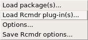

Select the mosaic plugin. The program will need to restart, so we do this before loading the data so we don’t have to do so again. In your graphs menu, you’ll now see a new option: 'mosaic or assoc plot.'

### Loading the data

We begin by loading the data set of 20,000 observations into the R workspace. After launching R Commander, we need to load our data. We can either download the data directly into R or we can import a data file which we have downloaded. Try both ways - you may find one or the other more useful. You can also import data from other programs, which we’ll get to later.

The data set `cdc` that shows up in your workspace is a data matrix, with each row representing a case and each column representing a variable. R calls this data format a *data frame*, which we’ll use interchangeably.

#### Directly in R:

We need to execute a command, so in the top box copy and paste the following line, and click `submit.`

```{r eval=FALSE}
source("http://www.openintro.org/stat/data/cdc.R")
```

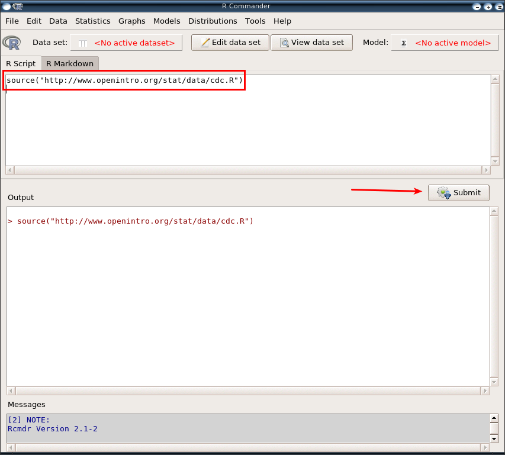

We now have loaded the data set, but we need to tell R Commander that we want to make it active. Click the box with the red `<No active dataset>`:

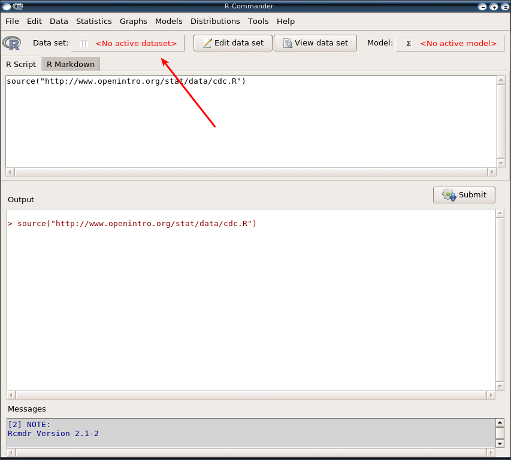

This brings up the following menu:

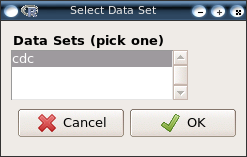

Click 'ok' to select the cdc data set. In the future, you may have multiple data sets you’re working on, and this menu lets you switch between them.

#### From a downloaded R data file:

We can also load the same data set from a file on your computer. Download this file: [cdc.Rdata](./cdc.Rdata) which is an R data file. From the data menu at the top of R Commander, select `load data set`:

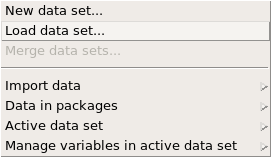

and select the file you have downloaded. It will automatically be selected as the active data set.

#### From another type of data file

Often, you will receive data from someone who has entered the data in another program (e.g. microsoft excel). For example, by going to [https://www.openintro.org/stat/data/?data=cdc](https://www.openintro.org/stat/data/?data=cdc), you will see a description of all of the cdc data variables, and an option to download the file. The file, however, is a csv (comma separated variable) file. Download the file, and open it in a plain text editor on your computer (something no fancier than notepad). You should see that the file only contains the values which would be in each cell of a spreadsheet, separated by a comma.

In R Commander, in the `data` menu, select `import data` then `from text file, clipboard, or URL`.

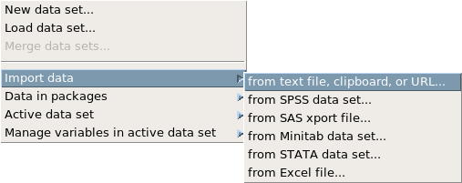

You’ll get a new window:

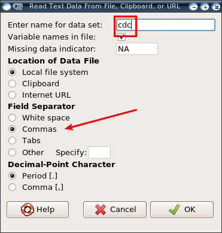

This is where we tell R Commander how the file is laid out. In the first line, we can pick a name for the data, such as `cdc`. We also need to change the field separator - this is the symbol used to separate information which would be in different columns in the data. We noticed that there were commas between the columns, so we need to change the field separator from 'white space' to 'commas.' Next click 'ok' and select the file you downloaded.

### Inspecting the data

By clicking `view data set`, we can see the data we will be working with:

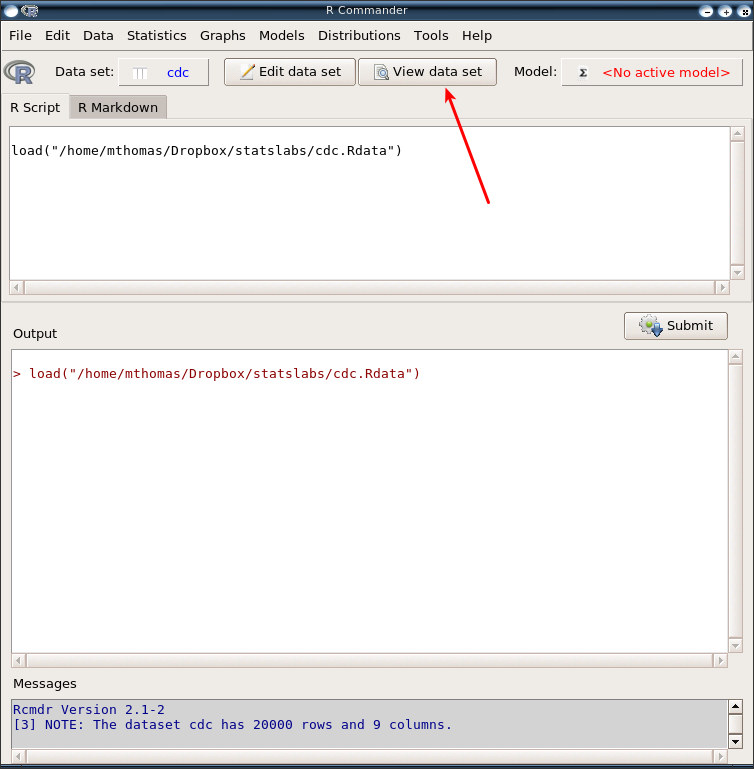

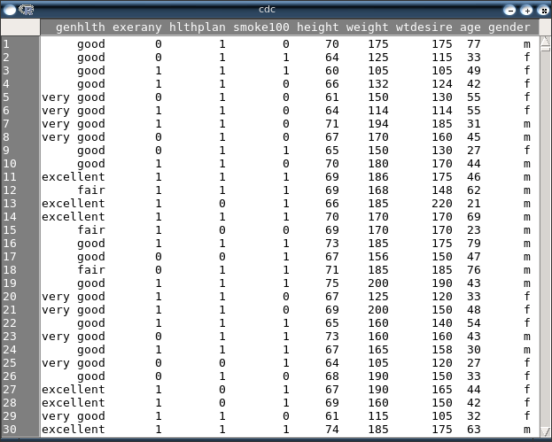

Notice we can see the names of the variables in the top row of the window: `genhlth`, `exerany`, `hlthplan`, `smoke100`, `height`, `weight`, `wtdesire`, `age`, and `gender`. Each one of these variables corresponds to a question that was asked in the survey. For example, for `genhlth`, respondents were asked to evaluate their general health, responding either *excellent*, *very good*, *good*, *fair* or *poor*. The `exerany` variable indicates whether the respondent exercised in the past month (1) or did not (0). Likewise, `hlthplan` indicates whether the respondent had some form of health coverage (1) or did not (0). The `smoke100` variable indicates whether the respondent had smoked at least 100 cigarettes in her lifetime. The other variables record the respondent’s `height` in inches, `weight` in pounds as well as their desired weight, `wtdesire`, `age` in years, and `gender`.

1. How many cases are there in this data set (hint: look at the note in the messages section at the bottom of the R Commander window? How many variables? For each variable, identify its data type (e.g. categorical, discrete).

### Summaries and tables

The BRFSS questionnaire is a massive trove of information. A good first step in any analysis is to distill all of that information into a few summary statistics and graphics. As a simple example, the function `summary` returns a numerical summary: minimum, first quartile, median, mean, second quartile, and maximum for quantitative variables. In the Statistics menu, select summaries, then active data set.

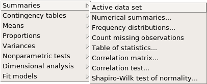

This provides a summary of each of the variables in your data set.

Notice that while R Commander gives us reasonable information for gender and general health, variables like smoke100 are being treated as quantitative variables instead of categorical. We need to recode these variables.

### Recoding Variables

In the data menu, select `manage variables in the active data set` then `convert numeric variables to factors`. (Factor is the term R uses for categorical variables.)

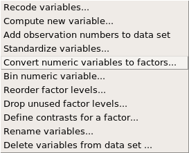

Select yes to overwriting the old variable, then you can give your levels names such as 'no' and 'yes' or whatever else you like. Are there other variables which you should switch to being factors? When you are done, get a new summary of the data set and make sure everything looks right. Try other options in the summary menu to see what other information R Commander can give you. What information does the 'frequency distributions' option give you?

R also functions like a very fancy calculator. If you wanted to compute the interquartile range for the respondents’ weight, you would look at the output from the summary command above and then type

```{r eval=FALSE}
190 - 140
```

into the R Script box, then click submit. Your result will show up in the Output box.

### Making a Bar Graph

To get a bar graph of a variable, for example the `smoke100` variable, we can select `bar graph` from the `graphs` menu.

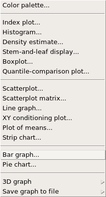

Select your `smoke100` variable, and rename your x or y axis labels or graph title if you like, then click ok.

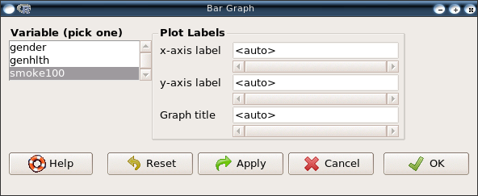

You should now be looking at a bar chart of your `smoke100` variable.

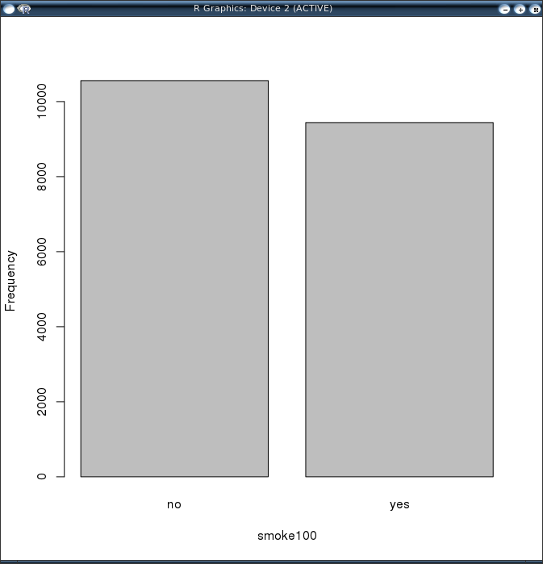

2. Create a numerical summary for `height` and `age`, and compute the interquartile range for each. Compute the relative frequency distribution for `gender` and `exerany`. How many males are in the sample? What proportion of the sample reports being in excellent health?

### Two-way Tables

To examine which participants have smoked across each gender, we can create a two-way table. In the 'statistics' menu, select 'contingency tables' then 'two-way table.'

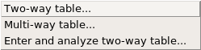

We’ll select `smoke100` and `gender`:

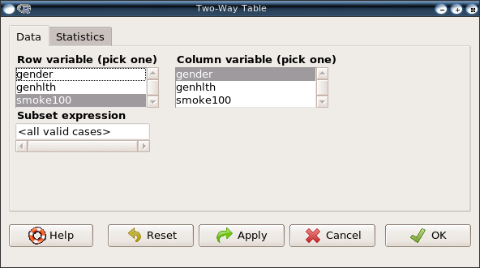

If you click on the statistics tab at the top, you’ll see other options, but we won’t need to worry about these now. What does this table tell us?

### Create Mosaic Plots (Optional)

If you opted to install the mosaic plugin during installation (see Lab 0), you can create mosaic plots.

Open the 'graph' menu to select 'mosaic or assoc plot.

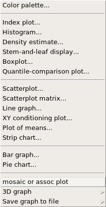

Click that option, and select your smoking habits and gender variables, then click 'ok' to produce your mosaic plot.

3. What does the mosaic plot reveal about smoking habits and gender?

### Quantitative data

#### Box Plots

We’ve already looked at categorical data such as `smoke` and `gender` so now let’s turn our attention to quantitative data. Two common ways to visualize quantitative data are with box plots and histograms. We can construct a box plot for a single variable by clicking 'Boxplot' in the 'graphs' menu.

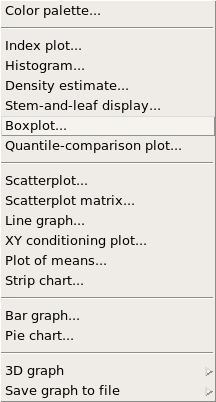

You can compare the locations of the components of the box by examining the summary statistics from earlier in the lab.

Confirm that the median and upper and lower quartiles reported in the numerical summary match those in the graph. The purpose of a boxplot is to provide a thumbnail sketch of a variable for the purpose of comparing across several categories. So we can, for example, compare the heights of men and women by using gender as a grouping variable. Open the boxplot menu again, but click the 'plot by groups' button.

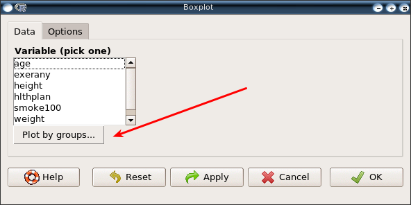

Select gender as your grouping variable:

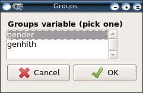

Click 'ok' to accept that grouping, then make sure you have height selected as your variable and click 'ok.'

## Constructing a New Variable

Next let’s consider a new variable that doesn’t show up directly in this data set: Body Mass Index (BMI). BMI is a weight to height ratio and can be calculated as:

$$BMI = \frac{weight (lbs)}{height(in)^2} \times 703$$

703 is the approximate conversion factor to change units from metric (meters and kilograms) to imperial (inches and pounds). In the 'data' menu, under 'manage variables in active data set,' select compute new variable.

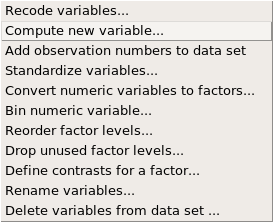

Type in the name of the new variable (bmi) and the formula for bmi.

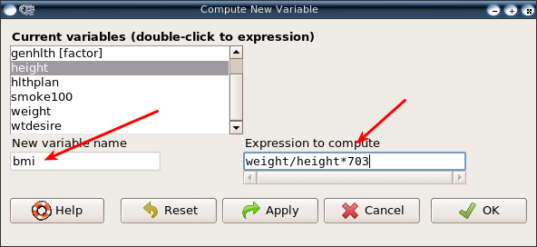

Notice that you can click a variable’s name instead of typing it in. Now create a boxplot of bmi, grouped by general health.

Notice that the first line above is just some arithmetic, but it’s applied to all 20,000 numbers in the `cdc` data set. That is, for each of the 20,000 participants, we take their weight, divide by their height-squared and then multiply by 703. The result is 20,000 BMI values, one for each respondent. This is one reason why we like R: it lets us perform computations like this using very simple expressions.

4. What does this box plot show? Pick another categorical variable from the data set and see how it relates to BMI. List the variable you chose, why you might think it would have a relationship to BMI, and indicate what the figure seems to suggest.

### Histograms

We can create a histogram for the ages of our respondents by selecting `histogram` from the `graphs` menu, and selecting age as our variable.

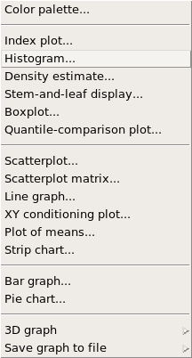

Histograms are generally a very good way to see the shape of a single distribution, but that shape can change depending on how the data is split between the different bins. You can control the number of bins by clicking the `options` tab in the histogram windows:

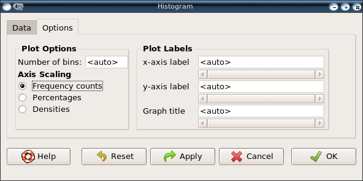

Try a few different values for the number of bins to see how the shape changes. 

At this point, we’ve done a good first pass at analyzing the information in the BRFSS questionnaire. We’ve found an interesting association between smoking and gender, and we can say something about the relationship between people’s assessment of their general health and their own BMI. We’ve also picked up essential computing tools – summary statistics, subsetting, and plots – that will serve us well throughout this course.

***

## On Your Own

- Make a scatterplot of weight versus desired weight. Describe the relationship between these two variables.
- Let’s consider a new variable: the difference between desired weight (`wtdesire`) and current weight (`weight`). Create this new variable by subtracting the two columns in the data frame and assigning them to a new object called `wdiff`.
- What type of variable is `wdiff`? If an observation `wdiff` is 0, what does this mean about the person’s weight and desired weight. What if `wdiff` is positive or negative?
- Describe the distribution of `wdiff` in terms of its center, shape, and spread, including any plots you use. What does this tell us about how people feel about their current weight?
- Using numerical summaries and a side-by-side box plot, determine if men tend to view their weight differently than women.
- What concepts from the textbook are covered in this lab? What concepts, if any, are not covered in the textbook? Have you seen these concepts elsewhere, e.g. lecture, discussion section, previous labs, or homework problems? Be specific in your answer.


<div id="license">
This is a product of OpenIntro that is released under a 
[Creative Commons Attribution-ShareAlike 3.0 Unported](http://creativecommons.org/licenses/by-sa/3.0). 
This lab was adapted by Matt Thomas for OpenIntro from a lab by Andrew Bray and Mine &Ccedil;etinkaya-Rundel 
from a lab written by Mark Hansen of UCLA Statistics.
</div>