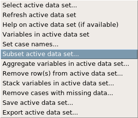

In this lab we’ll investigate the probability distribution that is most central to statistics: the normal distribution. If we are confident that our data are nearly normal, that opens the door to many powerful statistical methods. Here we’ll use the graphical tools of R and R Commander to assess the normality of our data and also learn how to generate random numbers from a normal distribution.

## The Data

This week we’ll be working with measurements of body dimensions. This data set contains measurements from 247 men and 260 women, most of whom were considered healthy young adults. Copy the following line into the R Script window to load the data:

```{r eval=FALSE}
download.file("http://www.openintro.org/stat/data/bdims.RData", destfile = "bdims.RData")
```

Load the data. (See previous labs if you’re not sure how to do this.) View the data set to get a feel for the data we’ll be looking at.

You’ll see that for every observation we have 25 measurements, many of which are either diameters or girths. A key to the variable names can be found at [http://www.openintro.org/stat/data/bdims.php](http://www.openintro.org/stat/data/bdims.php), but we’ll be focusing on just three columns to get started: weight in kg (`wgt`), height in cm (`hgt`), and `sex `(`1` indicates male, `0` indicates female).

Since males and females tend to have different body dimensions, it will be useful to create two additional data sets: one with only men and another with only women. This means we will be *subsetting* the data.

### Subsetting data

We want to create a subset for the male children and female children, so we will need to create two subsets. To create the subset for males, we select the `data` menu, then `active data set,` then `subset active data set.`



We’ll keep all the variables in our new subsets, so we leave `include all variables` checked. select all of the variables. We’ll name the new data set `mdims.` We now need to tell R how we want to subset our data. For the male data set, we want any of the cases where the `sex` variable is equal to 1. Since this variable is in the bdims data set, we tell R that we want `bdims$sex == 1`, and type this in the subset expression box, so before pressing ok, our menu should look like this:


Click on the data set choice in the R Commander window, 


and you will now see there is a new data set, `mdims,` which we have just created.


Select the new data set, and view it. Now, switch back to the original bdims data set and create a data set for all the female children, called `fdims`.

1. Make a histogram of men’s heights and a histogram of women’s heights. Do this in three ways: create a histogram from mdims, from fdims, and make a side-by-side histogram using bdims. How would you compare the various aspects of the two distributions?

## The normal distribution

In your description of the distributions, did you use words like `bell-shaped` or `normal`? It’s tempting to say so when faced with a unimodal symmetric distribution.

2. Change the number of bins in all of the previous distributions. Does the number of bins affect the shape of the distribution?

### Evaluating the normal distribution

Eyeballing the shape of the histogram is one way to determine if the data appear to be nearly normally distributed, but it can be frustrating to decide just how close the histogram is to the curve. An alternative approach involves constructing a normal probability plot, also called a normal Q-Q plot for `quantile-quantile`.

With the `fdims` data set active, in the graphs menu select Quantile-comparison plot.


Create the Q-Q plot for height.

A data set that is nearly normal will result in a probability plot where the points closely follow the line.

Any deviations from normality leads to deviations of these points from the line. The plot for female heights shows points that tend to follow the line but with some errant points towards the tails.

We’re left with the same problem that we encountered with the histogram above: how close is close enough?

A useful way to address this question is to rephrase it as: what do probability plots look like for data that I know came from a normal distribution? We can answer this by simulating data from a normal distribution with the same mean and standard deviation as the `fdims`data set. Determine the mean and standard deviation, and write them down so you’ll have them available for the next section. Also record the number of samples in the `fdims` data set. (You may find Numerical Summeries in the Summaries tab more useful than the Active Data Set summary since there are so many variables.)

In the distributions tab, select continuous distributions, normal distribution, sample from normal distribution.


We need to select how many numbers we’d like to generate as well as giving it the mean and standard deviation you found. 


Enter the mean, standard deviation, and number of samples we want to generate in the boxes. You can uncheck all of the other options, we will not need them.

3. Make a normal probability (Q-Q) plot of `NormalSamples`. Do all of the points fall on the line? How does this plot compare to the probability plot for the real data?

Even better than comparing the original plot to a single plot generated from a normal distribution is to compare it to many more plots using the following function. It may be helpful to click the `zoom` button in the plot window. Copy or type the following into the command window and click submit.

```{r eval=FALSE}
qqnormsim(fdims$hgt)
```

4. Does the normal probability plot for `fdims$hgt` look similar to the plots created for the simulated data? That is, do plots provide evidence that the female heights are nearly normal?

5. Using the same technique, determine whether or not female weights appear to come from a normal distribution.

### Normal probabilities

Okay, so now you have a slew of tools to judge whether or not a variable is normally distributed. Why should we care?

It turns out that statisticians know a lot about the normal distribution. Once we decide that a random variable is approximately normal, we can answer all sorts of questions about that variable related to probability. Take, for example, the question of, "What is the probability that a randomly chosen young adult female is taller than 6 feet (about 182 cm)?"*

If we assume that female heights are normally distributed (a very close approximation is also okay), we can find this probability by calculating a Z score and consulting a Z table (also called a normal probability table). In R Commander, we can select distributions, continuous distributions, normal distributions, normal probabilities.


Enter the value (the height), mean, standard deviation, and which tail you want to consider, and click `ok`. Your answer will appear in the Output window.

Assuming a normal distribution has allowed us to calculate a theoretical probability. If we want to calculate the probability empirically, we simply need to determine how many observations fall above 182 then divide this number by the total sample size.

```{r eval=FALSE}
sum(fdims$hgt>182)
length(fdims$hgt)
```

Although the probabilities are not exactly the same, they are reasonably close. The closer that your distribution is to being normal, the more accurate the theoretical probabilities will be.

6. Write out two probability questions that you would like to answer; one regarding female heights and one regarding female weights. Calculate those probabilities using both the theoretical normal distribution as well as the empirical distribution (four probabilities in all). Which variable, height or weight, had a closer agreement between the two methods?

***

## On Your Own

- Now let’s consider some of the other variables in the body dimensions data set. Using the figures below, match the histogram to its normal probability plot. All of the variables have been standardized (first subtract the mean, then divide by the standard deviation), so the units won’t be of any help. If you are uncertain based on these figures, generate the plots in R to check.

    **a.** The histogram for female biiliac (pelvic) diameter (`bii.di`) belongs to normal probability plot letter __.
  
    **b.** The histogram for female elbow diameter (`elb.di`) belongs to normal probability plot letter __.
  
    **c.** The histogram for general age (`age`) belongs to normal probability plot letter __.
  
    **d.** The histogram for female chest depth (`che.de`) belongs to normal probability plot letter __.

    

- Note that normal probability plots C and D have a slight stepwise pattern. Why do you think this is the case?
- As you can see, normal probability plots can be used both to assess normality and visualize skewness. Make a normal probability plot for female knee diameter (`kne.di`). Based on this normal probability plot, is this variable left skewed, symmetric, or right skewed? Use a histogram to confirm your findings.
- What concepts from the textbook are covered in this lab? What concepts, if any, are not covered in the textbook? Have you seen these concepts elsewhere, e.g. lecture, discussion section, previous labs, or homework problems? Be specific in your answer.

---

The study that published this data set is clear to point out that the sample was not random and therefore inference to a general population is not suggested. We do so here only as an exercise.


<div id="license">
This is a product of OpenIntro that is released under a 
[Creative Commons Attribution-ShareAlike 3.0 Unported](http://creativecommons.org/licenses/by-sa/3.0). 
This lab was adapted by Matt Thomasfor OpenIntro from a lab by Andrew Bray and Mine &Ccedil;etinkaya-Rundel
from a lab written by Mark Hansen of UCLA Statistics.
</div>