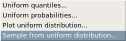
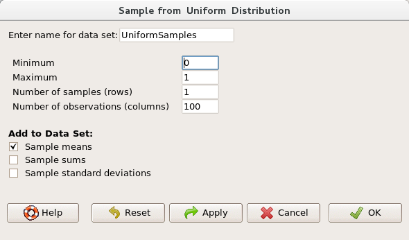
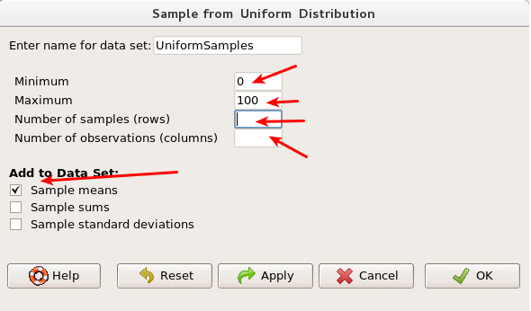

In this lab, we investigate the ways in which the statistics from a random sample of data can serve as point estimates for population parameters. We’re interested in formulating a sampling distribution of our estimate in order to learn about the properties of the estimate, such as its distribution.

## The data

We consider data coming from a variety of distributions. We can ask R Commander to create samples of any size, any number of time, from a large collection of distributions.

Let’s look at sampling from the Uniform distribution. Go to distributions, then continuous distributions, then uniform distribution, then sample from uniform distribution. 

Which will bring up the menu:

To define the uniform distribution, we need to provide a minimum and maximum value. We will select numbers between 0 and 100, so you will need to change your maximum value.

The number of samples is the number of times we will sample from the distribution. The number of observations is the number of individuals to be measured for each sample.

1. Sample from the uniform distribution 100 times, where each sample is a single person. Create a histogram of your new variable. Is it what you would expect? Sample again from your distribution, this time 10,000 times. How does your histogram change?

## The sampling distribution

In this lab we know information about the entire population (the population distribution), but this is rarely the case in real life. Gathering information on an entire population is often extremely costly or impossible. Because of this, we often take a sample of the population and use that to understand the properties of the population.

If we’re interested in estimating the average of the distribution, our best single guess is the sample mean.

2. Take a sample of 50 individuals from a uniform distribution with minimum 0 and maximum 100. Determine the mean of your sample. How does it compare with the mean of the population the sample was drawn from?

Depending on which values were selected, your estimate could be a bit above or a bit below the true population mean of 50. In general, though, the sample mean turns out to be a pretty good estimate.

3. Take a second sample, also of size 50. How does the mean of this sample compare with the mean of the original sample? Suppose we took two more samples, one of size 100 and one of size 1000. Which would you think would provide a more accurate estimate of the population mean?

Not surprisingly, every time we take another random sample, we get a different sample mean. It’s useful to get a sense of just how much variability we should expect when estimating the population mean this way. The distribution of sample means, called the sampling distribution, can help us understand this variability. In this lab, because we have access to the population distribution, we can build up the sampling distribution for the sample mean by repeating the above steps many times.

Here we will generate 5000 samples of size 50 and compute the sample mean of each. Again open the window to draw samples from a uniform distribution:

Ensure that your maximum and minimum are set at 0 and 100. For your number of samples, you will enter 5000 and number of observations you will enter 50. Keep the sample means box checked. This will make sure the mean of each sample is computed.

View this data set. What does each row in the data frame indicate? What does each column indicate?

4. Create a histogram of to “mean” variable in your new data set. What is this variable measuring? How would you describe the shape? How does its shape compare with the shape of the original distribution? Would you expect the distribution to change if we instead collected 50,000 sample means

## Sample size and the sampling distribution

The sampling distribution that we computed tells us much about estimating the parent distribution. The sampling distribution is centered at the true average of the population, and the spread of the distribution indicates how much variability is induced by sampling only 50 values.

To get a sense of the effect that sample size has on our distribution, let’s build up two more sampling distributions: one based on a sample size of 10 and another based on a sample size of 100. Create new variables for each of them, naming each variable something helpful, like sample10 and sample100. For each variable, sample 5000 times, as with the previous example.

Create histograms of each, noting any relevant details. You may find it helpful to save each image and view them side-by-side, since each graph will be replaced when creating the next one.

5. When the sample size is larger, what happens to the center? What about the spread?

* * *

## On your own

So far, we have only focused on the uniform distribution. For the exercises, we will use a binomial distribution (in the list of discrete distributions). Use a binomial distribution with n=71 and p=0.05.

- Take a random sample of size 50 from your distribution. Using this sample, what is your best point estimate of the population mean?
- Since you have access to the population, simulate the sampling distribution by taking 5000 samples from the population of size 50 and computing 5000 sample means. Plot the means, then describe the shape of this sampling distribution. Based on this sampling distribution, what would you guess the mean of the population to be? Determine the actual mean of this distribution.
- Change your sample size from 50 to 150, then compute the sampling distribution using the same method as above. Describe the shape of this sampling distribution, and compare it to the sampling distribution for a sample size of 50. Based on this sampling distribution, what would you guess to be the mean of the population?
- Of the sampling distributions from questions 2 and 3, which has a smaller spread? If we’re concerned with making estimates that are more often close to the true value, would we prefer a distribution with a large or small spread?
- What is the mean of the population? How do each of your estimates compare with this value?

This is a product of OpenIntro that is released under a [Creative Commons 
Attribution-ShareAlike 3.0 Unported](http://creativecommons.org/licenses/by-sa/3.0).
This lab was adapted by Matt Thomas from a lab written for OpenIntro by Andrew Bray and Mine &Ccedil;etinkaya-Rundel.

