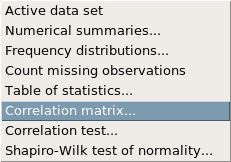

## Batter up

The movie [Moneyball](http://en.wikipedia.org/wiki/Moneyball_(film)) focuses on the "quest for the secret of success in baseball". It follows a low-budget team, the Oakland Athletics, who believed that underused statistics, such as a player’s ability to get on base, better predict the ability to score runs than typical statistics like home runs, RBIs (runs batted in), and batting average. Obtaining players who excelled in these underused statistics turned out to be much more affordable for the team.

In this lab we’ll be looking at data from all 30 Major League Baseball teams and examining the linear relationship between runs scored in a season and a number of other player statistics. Our aim will be to summarize these relationships both graphically and numerically in order to find which variable, if any, helps us best predict a team’s runs scored in a season.

## The data

Let’s load up the data for the 2011 season. Run the following command and then load the data:

```{r eval=FALSE}
download.file("http://www.openintro.org/stat/data/mlb11.RData", destfile ="mlb11.RData")
```

Make sure the appropriate data set is active. In addition to runs scored, there are seven traditionally used variables in the data set: at-bats, hits, home runs, batting average, strikeouts, stolen bases, and wins. There are also three newer variables: on-base percentage, slugging percentage, and on-base plus slugging. For the first portion of the analysis we’ll consider the seven traditional variables. At the end of the lab, you’ll work with the newer variables on your own.

1. What type of plot would you use to display the relationship between `runs` and one of the other numerical variables? Plot this relationship using the variable `at_bats` as the predictor. (Hint: Look in the graphs menu.) )Does the relationship look linear? If you knew a team’s `at_bats`, would you be comfortable using a linear model to predict the number of runs?

If the relationship looks linear, we can quantify the strength of the relationship with the correlation coefficient. In statistics, then summaries, select correlation matrix.



This is a matrix because we could (if we wanted) find correlations between many different pairs of variables at the same time. Select runs and at_bats as your variables, leaving all the other options at their defaults.

## Sum of squared residuals

Think back to the way that we described the distribution of a single variable. Recall that we discussed characteristics such as center, spread, and shape. It’s also useful to be able to describe the relationship of two numerical variables, such as `runs` and `at_bats` above.

2. Looking at your plot from the previous exercise, describe the relationship between these two variables. Make sure to discuss the form, direction, and strength of the relationship as well as any unusual observations.

Just as we used the mean and standard deviation to summarize a single variable, we can summarize the relationship between these two variables by finding the line that best follows their association. 

3. Copy the following code into the code box and click submit to create an interactive function to select the line that you think does the best job of going through the cloud of points. 

```{r eval=FALSE}
plot_ss(x = mlb11$at_bats, y = mlb11$runs)
```

After running this command, you’ll be prompted to click two points on the plot (anywhere) to define a line. Once you’ve done that, the line you specified will be shown in black and the residuals in blue. In the output window in R Commander, it will display the sum of the squares of the residuals. Close the window and rerun the command to try it again. How small can you make the sum of the squares of the residuals?

Note that there are 30 residuals, one for each of the 30 observations. Recall that the residuals are the difference between the observed values and the values predicted by the line:


The most common way to do linear regression is to select the line that minimizes the sum of squared residuals. To visualize the squared residuals, you can rerun the plot command and add the argument `showSquares = TRUE`:

```{r eval=FALSE}
plot_ss(x = mlb11$at_bats, y = mlb11$runs, showSquares =TRUE)
```

Note that the output from the `plot_ss` function provides you with the slope and intercept of your line as well as the sum of squares.

4. Using the above `plot_ss command`, choose a line that does a good job of minimizing the sum of squares. Run the function several times. What was the smallest sum of squares that you got? How does it compare to your neighbors?

## The linear model

It is rather cumbersome to try to get the correct least squares line, i.e. the line that minimizes the sum of squared residuals, through trial and error. Instead we can have R fit the linear model (a.k.a. regression line).

Go to the Statistics menu, then Fit models, then linear regression.


For the name, you can name your model whatever you like. For our variables, we will still use runs and at_bats. Which of these should be the response variable and which should be the explanatory variable?

Select your variables and click ok. In your output box, you should see a summary of your model. Let’s consider this output piece by piece. First, the formula used to describe the model is shown at the top. After the formula you find the five-number summary of the residuals. The "Coefficients"" table shown next is key; its first column displays the linear model’s y-intercept and the coefficient of `at_bats`. With this table, we can write down the least squares regression line for the linear model:

$$\hat{y} = −2789.2429 + 0.6305 \times at\_bats$$

One last piece of information we will discuss from the summary output is the Multiple R-squared, or more simply, $R^2$. The $R^2$ value represents the proportion of variability in the response variable that is explained by the explanatory variable. For this model, 37.3% of the variability in runs is explained by at-bats.

5. Fit a new model that uses `homeruns` to predict `runs`. Using the estimates from the R output, write the equation of the regression line. What does the slope tell us in the context of the relationship between success of a team and its home runs?

## Prediction and prediction errors

Let’s create a scatterplot with the least squares line laid on top. Create a scatterplot of `runs` vs `at_bats` (runs as the y variable and at_bats as the x variable). Before clicking ok, select the options tab.


Check the box for the least-squares line:


This line is a plot of the least-squares line, and can be used to predict `y` for any value of `x`. When predictions are made for values of `x` that are beyond the range of the observed data, it is referred to as *extrapolation*  and is not usually recommended. However, predictions made within the range of the data are more reliable. They’re also used to compute the residuals.

6. If a team manager saw the least squares regression line and not the actual data, how many runs would he or she predict for a team with 5,578 at-bats? Is this an overestimate or an underestimate, and by how much? In other words, what is the residual for this prediction?

## Model diagnostics

To assess whether the linear model is reliable, we need to check for (1) linearity, (2) nearly normal residuals, and (3) constant variability.

*Linearity* : You already checked if the relationship between runs and at-bats is linear using a scatterplot. We should also verify this condition with a scatterplot of the residuals vs x values.

To do this, we will create a new variable, the residuals. Under models,  select add observation statistics to data. We will only be interested in the residuals right now, so deselect everything except residuals.


Create a scatterplot of residuals vs at_bats.

7. Is there any apparent pattern in the residuals plot? What does this indicate about the linearity of the relationship between runs and at-bats?

*Nearly normal residuals* : To check this condition, we can look at a histogram of the residuals. Create this histogram as well as a qqplot of the residuals.

8. Based on the histogram and the normal probability plot, does the nearly normal residuals condition appear to be met?

*Constant variability* :

* Based on the scatterplot in your test for linearity, does the constant variability condition appear to be met?

An alternative way to analyze these conditions (though not identical) is through the diagnostic plots. Select Models, then graphs, then basic diagnostic plots.


This will produce four plots. Determine how the top two graphs relate to the graphs we have analyzed here.

* * *


## On Your Own

- Choose another traditional variable from <span class="c1">mlb11</span> that you think might be a good predictor of <span class="c1">runs</span>. Produce a scatterplot of the two variables and fit a linear model. At a glance, does there seem to be a linear relationship?
- How does this relationship compare to the relationship between `runs` and `at_bats`? Use the $R^2$ values from the two model summaries to compare. Does your variable seem to predict `runs` better than `at_bats`? How can you tell?
- Now that you can summarize the linear relationship between two variables, investigate the relationships between `runs` and each of the other five traditional variables. Which variable best predicts `runs`? Support your conclusion using the graphical and numerical methods we’ve discussed (for the sake of conciseness, only include output for the best variable, not all five).
- Now examine the three newer variables. These are the statistics used by the author of *Moneyball*  to predict a team’s success. In general, are they more or less effective at predicting runs that the old variables? Explain using appropriate graphical and numerical evidence. Of all ten variables we’ve analyzed, which seems to be the best predictor of `runs`? Using the limited (or not so limited) information you know about these baseball statistics, does your result make sense?
- Check the model diagnostics for the regression model with the variable you decided was the best predictor for runs.


<div id="license">
This is a product of OpenIntro that is released under a [Creative Commons 
Attribution-ShareAlike 3.0 Unported](http://creativecommons.org/licenses/by-sa/3.0). 
This lab was adapted by Matt Thomas for OpenIntro from a lab by Andrew Bray and Mine &Ccedil;etinkaya-Rundel 
from a lab written by the faculty and TAs of UCLA Statistics.
</div>
